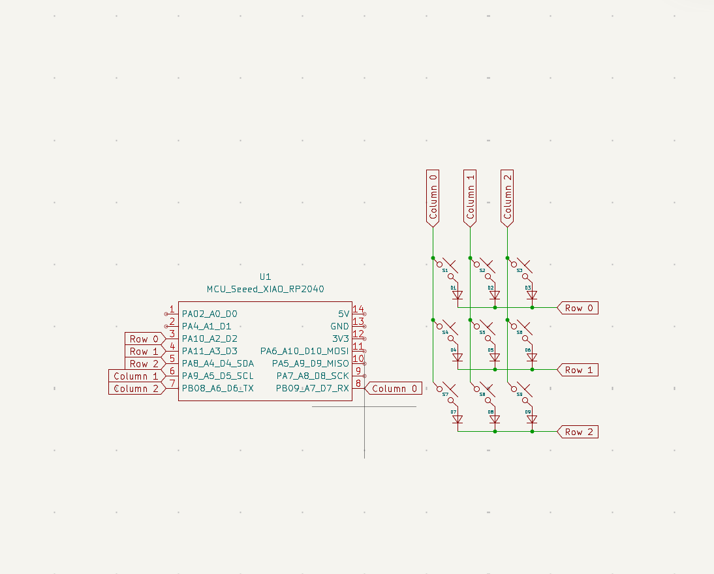
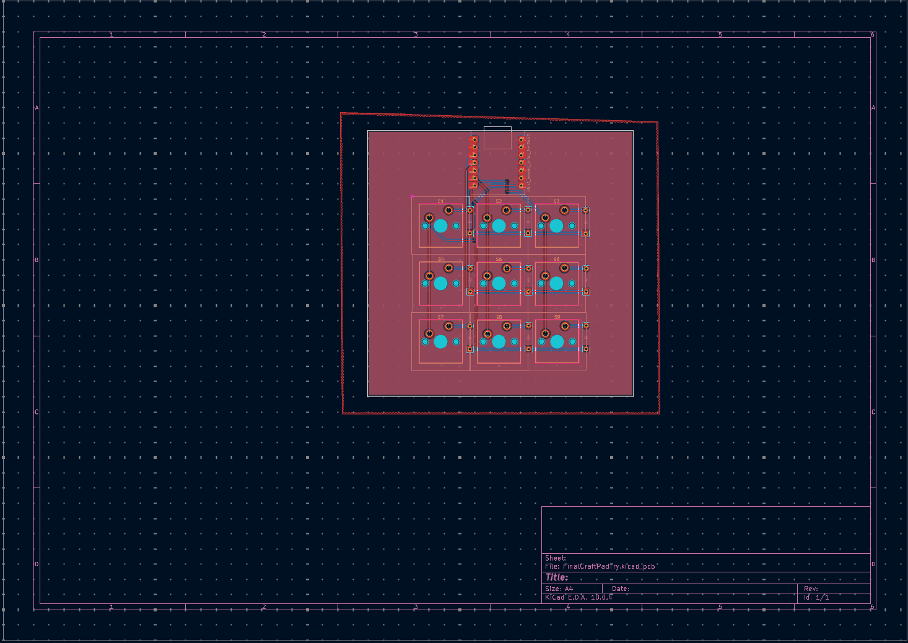

# CraftPad

This is my submission for the Hack Club Hackpad event! The CraftPad is a custom designed 9-key macropad built using a Seeed XIAO RP2040 and QMK firmware, specifically programmed to launch applications like Discord and Minecraft.

## Screenshots

### Overall Hackpad

### Schematic

### PCB

## Bill of Materials (BOM)
* 1x Seeed Studio XIAO RP2040
* 9x MX-style Mechanical Switches
* 9x White Blank DSA Keycaps
* 20x Through-hole 1N4148 Diodes
* 20x SK6812 MINI-E LEDs
* 6x M3x16mm Screws
* 6x M3x5mmx4mm Heat-set Inserts
